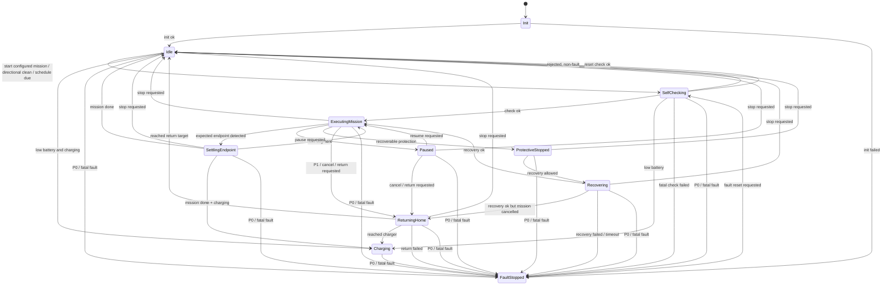

# Minimal Robot Architecture Refactor Design

Date: 2026-05-31
Status: User-approved design direction, pending implementation plan

## Goal

重构 `middleware`、`domain`、`service`、`app` 层，使商业级干挂式无水清洁光伏清扫机器人具备清晰、稳定、可验证的任务控制核心。

设计目标不是增加更多抽象，而是做减法：

- 保留 `hal`、`driver`、`protocol`、`device` 当前实现思路。
- 收敛 `middleware/service/app/domain` 的职责边界。
- 移除或合并过薄、重复、反向依赖的代码路径。
- 避免把业务状态散落在多个 manager、handler、callback 中。
- 保证实现简洁、稳定、可靠，不把文件和类拆得过散。

## Non-Negotiable Constraints

- 机器人只在左右两个端点接近传感器之间工作。
- 中间允许停车做姿态矫正，但中间不会新增物理停止触发点。
- 低电量策略是禁止启动；运行中低电量是否返航作为独立 P1 策略处理。
- 调度时间修改必须立即生效。
- 其他运行参数默认下次任务生效。
- 当前主通信链路是 4G/MQTT。
- LoRaWAN 只作为未来扩展，不进入当前主链路复杂度。
- P0 类安全动作不能等待普通事件队列，必须先硬停，再同步状态。
- 重构期间每一步都必须能独立构建和测试。

## Minimal Layer Boundary

最终边界保持四层，但不追求“层层包装”。

```text
middleware: 基础设施
domain: 业务语义和纯规则
service: 设备能力和业务能力落地
app: 状态机、事件循环、动作分发
```

禁止方向：

```text
domain -> service/app/middleware/device
middleware -> service/app/domain business policy
service -> app
FSM -> concrete device/driver/protocol
```

允许方向：

```text
main.cc -> all layers as composition root
app -> domain + service public capabilities
service -> domain + middleware + device
middleware -> HAL/basic utilities only
```

## Keep The Architecture Small

本次重构必须优先合并和简化。

建议控制点：

- `RobotFsm` 只做状态迁移，输出 `Action`。
- `RobotApp` 或 `RobotSupervisor` 作为唯一业务编排入口。
- `ActionDispatcher` 第一版可以只是 `RobotApp` 的私有函数，不强制独立成类。
- `FaultPolicy` 第一版可以是静态表或简单函数，不做规则引擎。
- `Recovering` 保留为状态，但恢复动作先由现有运动能力承载，不创建复杂恢复框架。
- `EventQueue` 只做主状态机事件串行化，不替代所有现有基础设施。
- `ReportOutbox` 只用于网络断连后的遥测、故障、任务结果补发，不影响安全动作。

不建议第一版引入：

- service locator
- factory hierarchy
- plugin system
- command bus framework
- 多套 event bus 并存
- 为每个小动作创建一个 class
- 为 LoRaWAN 当前未使用场景扩展主流程

## Domain Model

`domain` 只放纯业务名词、纯状态、纯规则，不放设备调用端口。

当前 `domain::RobotControlPort`、`MotionPort`、`EmergencyStopPort` 这类调用端口应移出 domain，放到 app/service 边界附近。domain 不应该定义“如何调用电机”，只定义“业务上要做什么”。

### Core Concepts

推荐先定义少量跨模块核心枚举，避免业务命名分散。

```cpp
enum class DockMode {
    SingleDock,
    DualDock
};

enum class CommandSource {
    Rpc,
    Scheduler,
    Local,
    FaultPolicy,
    System
};
```

### Endpoint

底层先表达物理事实，再由任务上下文解释业务角色。

推荐语义：

```cpp
enum class EndpointId {
    Left,
    Right
};

enum class EndpointPoseKind {
    Unknown,
    OnSegment,
    AtEndpoint,
    Inconsistent
};

struct EndpointPose {
    EndpointPoseKind kind;
    std::optional<EndpointId> endpoint;
};

struct LaneGeometry {
    DockMode dock_mode;
    EndpointId parking_endpoint;
};
```

规则：

- 左右接近传感器都触发：`Inconsistent`，禁止启动，运行中进入故障处理。
- 只有一个接近传感器触发：`AtEndpoint(Left/Right)`。
- 两个都未触发：有可信任务上下文、姿态和里程计时为 `OnSegment`，否则为 `Unknown`。
- 启动事件不再传 `bool at_parking_side` 和 `bool at_far_end` 作为业务真相。
- 当前位置由 `EndpointService` 或等价逻辑统一估计。
- `parking_endpoint` 来自配置；`return_endpoint` 是另一端。
- `AtEndpoint(endpoint)` 是否是停机位或返机位，由 `LaneGeometry` 解释，不由传感器层解释。
- 商业级启动不要求一定在端点，但要求当前位置可信：`AtEndpoint` 或 `OnSegment` 可启动定向任务，`Unknown` 和 `Inconsistent` 不可启动。
- 不保留 `EndpointRole` 字段；端点角色由 `LaneGeometry` 的纯函数推导，避免一个端点同时被错误标记为两个角色。

### Mission

废弃“趟数 passes 作为核心语义”。

推荐语义：

```cpp
enum class MissionKind {
    ConfiguredMission,
    CleanTowardReturnEndpoint,
    CleanTowardParkingEndpoint,
    BrushOffReturnHome
};

enum class SegmentTarget {
    ParkingEndpoint,
    ReturnEndpoint
};

enum class SegmentMode {
    Cleaning,
    BrushOffReturn
};

struct MissionSegment {
    SegmentTarget target;
    SegmentMode mode;
};

struct MissionContext {
    MissionKind kind;
    CommandSource source;
    std::string command_id;
    std::vector<MissionSegment> segments;
    std::size_t current_segment_index{0};
    uint32_t repeat_count{1};
    uint32_t completed_cycles{0};
};
```

规则：

- 单停机位：从停机位到返机位，再从返机位回停机位，才是一次完整清扫任务。
- 双停机位：从任一停机位到另一个停机位，就是一次完整清扫任务。
- 如果需要重复执行，使用 `repeat_count`，表示完整任务次数。
- 不再用 `0.5 pass`、`1 pass` 这种容易误解的业务表达。
- `ConfiguredMission` 是正式配置任务；单停机位下生成 `Parking -> Return -> Parking`，双停机位下生成 `CurrentDock -> OtherDock`。
- `CleanTowardReturnEndpoint` 是单段清扫任务：无论当前位置是否在停机位，只要位置可信，就向返机位方向清扫，到返机位稳定后停止。
- `CleanTowardParkingEndpoint` 是单段清扫任务：无论当前位置是否在返机位，只要位置可信，就向停机位方向清扫，到停机位稳定后停止。
- `BrushOffReturnHome` 用于故障、取消、低电量等非清扫返航，不用于 RPC 定向清扫。
- 如果定向清扫命令下发时已经位于目标端点，应视为幂等成功：不启动电机，直接保持停止并上报完成。
- 只有 `ConfiguredMission` 使用 `repeat_count` 和 `completed_cycles`；两个定向清扫命令固定执行一次单段任务。
- 不保留 `StartLocationRequirement` 字段；启动规则由 `MissionKind + DockMode + EndpointPose` 纯函数推导，避免任务字段和任务类型互相矛盾。
- 不保留 `CompletionPolicy` 字段；到达目标端点后，如果还有下一段就继续，没有下一段就是任务完成。
- `RecoveryMotion` 不作为 `MissionKind`；它是 `Recovering` 状态下的 service 内部多阶段流程。

### Command Model

远程 RPC、调度、本地按钮、故障策略都只是命令来源，不是状态来源。

推荐语义：

```cpp
enum class RobotCommandKind {
    StartConfiguredMission,
    CleanTowardReturnEndpoint,
    CleanTowardParkingEndpoint,
    Stop,
    Pause,
    Resume,
    ReturnHome,
    FaultReset
};

struct RobotCommand {
    RobotCommandKind kind;
    CommandSource source;
    std::string command_id;
};
```

RPC 当前需要闭环支持 4 个业务命令：

- `CleanTowardReturnEndpoint`: 机器由停机位方向向返机位方向清扫，到达返机位停止；不要求启动时已经在停机位。
- `CleanTowardParkingEndpoint`: 机器由返机位方向向停机位方向清扫，到达停机位停止；不要求启动时已经在返机位。
- `Stop`: 取消当前任务并原地停止。
- `StartConfiguredMission`: 机器从停机位开始，按照当前配置执行完整任务。

RPC 层只负责协议解析和 accepted/rejected 回执；最终执行结果通过带 `command_id` 的 status event 或 telemetry 上报。FSM 不允许出现只为 RPC 回执或远程控制 bookkeeping 设计的状态。

### Motion Semantics

domain 表达运动意图，不表达电机正负号。

推荐语义：

```cpp
enum class TravelDirection {
    TowardLeftEndpoint,
    TowardRightEndpoint
};

enum class WheelId {
    LeftUpper,
    LeftLower,
    RightUpper,
    RightLower
};

enum class BrushMode {
    Off,
    Cleaning,
    ReverseCleaning
};
```

速度规则：

- 配置中的速度使用绝对值。
- 行进方向由 `TravelDirection` 表达。
- 运动模式复用 `SegmentMode`，不再定义第二套 `MotionMode`。
- 电机正反号由 `MotionService` 或私有 `DriveKinematics` 逻辑根据机械安装映射。
- FSM 和 domain 不允许出现类似 `left_top = +rpm`、`left_bottom = -rpm` 的设备级语义。

PID 规则：

- PID 输出可以是带符号纠偏量，但符号含义必须是机器人坐标系下的固定物理定义。
- PID 输出不直接等价于某个电机加减速。
- 纠偏量由运动层结合行进方向、电机极性、轮组位置换算成四轮目标速度。

### Domain Field Review

当前 domain 字段按“不能稳定推导才保留”的原则收敛。

必须保留：

- `DockMode`: 单停机位和双停机位任务生成规则不同，不能从端点传感器推导。
- `CommandSource`: 用于日志、审计、RPC 闭环、调度来源区分，不参与状态膨胀。
- `EndpointId`: 物理左右端点的最小事实。
- `EndpointPoseKind` 和 `EndpointPose`: 表示当前位置是否可信，是启动准入和故障判断的基础。
- `LaneGeometry::parking_endpoint`: 停机位是哪一端来自配置，不能从传感器推导。
- `MissionKind`: 区分完整配置任务、两个 RPC 定向清扫任务、无刷返航任务。
- `MissionSegment::target`: 当前段必须知道目标端点角色。
- `MissionSegment::mode`: 当前段必须知道清扫还是无刷返航。
- `MissionContext::command_id`: RPC accepted 后的完成/失败上报需要闭环关联。
- `MissionContext::current_segment_index`: 状态机需要知道当前执行到哪一段。
- `MissionContext::repeat_count` 和 `completed_cycles`: 只有配置完整任务需要，用于完整任务重复执行。

明确不保留：

- `EndpointRole`: 可由 `LaneGeometry + EndpointId` 推导。
- `StartLocationRequirement`: 可由 `MissionKind + DockMode + EndpointPose` 推导。
- `CompletionPolicy`: 可由 `current_segment_index + segments.size()` 推导。
- `MissionKind::RecoveryAdjustment`: 恢复动作属于 `Recovering` 状态下的 `RecoveryMotion` 内部流程，不是清扫任务。
- `MotionMode`: 与 `SegmentMode` 重复。

## App State Machine

推荐状态集：

```text
Init
Idle
SelfChecking
ExecutingMission
SettlingEndpoint
ReturningHome
Paused
ProtectiveStopped
Recovering
Charging
FaultStopped
```

这些状态全部是机器人业务状态，不是命令来源状态。不得增加 `RpcStarting`、`RpcReturning`、`RemoteControlling` 这类 RPC 专属状态。

RPC、调度、本地按钮和故障策略统一转换为 `RobotCommand` / `RobotEvent`：

```text
RPC CleanTowardReturnEndpoint      -> StartRequested(MissionKind::CleanTowardReturnEndpoint)
RPC CleanTowardParkingEndpoint     -> StartRequested(MissionKind::CleanTowardParkingEndpoint)
RPC StartConfiguredMission         -> StartRequested(MissionKind::ConfiguredMission)
RPC Stop                           -> StopRequested
Scheduler StartConfiguredMission   -> StartRequested(MissionKind::ConfiguredMission)
FaultPolicy BrushOffReturnHome     -> ReturnHomeRequested(MissionKind::BrushOffReturnHome)
```

`ExecutingMission` 表示正在执行一个 `MissionContext` 的当前段。它既可以执行正式完整任务，也可以执行 RPC 单段定向清扫。状态机不通过状态名区分 RPC、调度或本地命令。

`ReturningHome` 只表示非清扫返航或保护性返航，例如 P1 故障、取消任务后返航、低电量运行中返航。RPC 的“向停机位方向清扫”不是 `ReturningHome`，它是 `ExecutingMission` 中的 `CleanTowardParkingEndpoint` 单段清扫任务。

不建议第一版增加 `EmergencyStopped`。

原因：

- P0、急停、总线失联、严重限位异常应立即硬停。
- 硬停后进入 `FaultStopped`，通过 fault reason 区分来源。
- 只有当急停复位流程和普通故障复位流程完全不同，再单独增加 `EmergencyStopped`。

`Recovering` 保留。

原因：

- `ProtectiveStopped` 表示已经保护停车。
- 如果只是等待异常自然消失，不需要 `Recovering`。
- 当前需求包含主动姿态调整动作，因此需要 `Recovering` 表达“正在恢复姿态”。
- `Recovering` 成功后回到原任务段，失败或超时后进入 `FaultStopped`。

## Main State Flow



## Event Queue And Outbox

需要事件队列，但只保留一个主业务事件入口。

推荐结构：

```text
RobotEventQueue -> RobotEventLoop -> RobotFsm -> vector<Action> -> dispatch_actions()
```

第一版 `outbox` 不需要复杂持久化类。

动作可以是简单枚举加参数：

```cpp
enum class RobotAction {
    StartCleanMotion,
    StartBrushOffReturn,
    StartRecoveryMotion,
    StopMotion,
    EmergencyStopMotion,
    StartEndpointSettlingTimer,
    PersistMissionContext,
    PromotePendingConfig,
    PublishStatus,
    ReportFault
};
```

规则：

- FSM 不直接调用 `MotionService`、`ConfigService`、`TelemetryService`。
- FSM 根据事件返回动作列表。
- `RobotApp` 串行 dispatch 动作。
- 安全硬停不等普通队列，安全线程先执行 `EmergencyStopMotion` 等价硬停，再投递 P0 事件同步状态。
- 网络上报使用独立 `ReportOutbox` 或现有缓存，不影响主状态机动作执行。
- RPC command handler 不直接调用运动服务，也不直接改 FSM 状态；它只投递 `RobotCommand` 并返回 accepted/rejected。
- `accepted` 只表示命令已被本机业务层接受，不表示电机已经完成动作；完成、失败、被故障打断必须通过 status event / telemetry 闭环上报。

## Fault Policy

故障处理需要表驱动，但不要做复杂规则引擎。

推荐最小模型：

```cpp
enum class FaultAction {
    WarnOnly,
    RejectStart,
    ProtectiveStop,
    StartRecovery,
    StopAndReturnHome,
    BrushOffReturnHome,
    EnterFaultStopped,
    ImmediateEmergencyStop
};
```

典型映射：

```text
低电量启动: RejectStart / Charging
短暂姿态异常: ProtectiveStop -> StartRecovery
姿态恢复超时: EnterFaultStopped
左右限位同时触发: EnterFaultStopped
驱动器严重故障: ImmediateEmergencyStop
CAN/总线失联: ImmediateEmergencyStop
滚刷异常: BrushOffReturnHome 或 EnterFaultStopped
P1 故障: StopAndReturnHome
P1 返航中再次故障: EnterFaultStopped
P0 故障: ImmediateEmergencyStop -> FaultStopped
```

故障表可以先放在 `fault_policy.h/.cc` 或现有 `fault_service` 附近。不要引入动态规则配置，除非后续明确需要现场可配置故障策略。

## Service Responsibilities

服务层只保留真正有业务价值的能力。

建议保留或收敛为：

- `MotionService`: 运动意图到四轮和滚刷设备命令的映射。
- `SelfCheckService`: 启动前自检。
- `EndpointService`: 接近传感器、任务上下文、里程计融合后的端点估计。
- `FaultService`: 故障采集、故障表匹配、故障上报入口。
- `ConfigService`: active/pending 配置管理，调度时间立即生效。
- `TelemetryService` 或现有 `CloudService`: 遥测、任务状态、故障上报。
- `SchedulerService`: 调度窗口判断和更新。

应合并或避免：

- 只有一行转发的 service。
- 同时修改 FSM 状态的多个 handler。
- 既懂协议又懂任务状态的 control plane。
- 与 `MotionService` 重叠的导航/运动封装。

## Middleware Responsibilities

middleware 只做基础设施。

允许：

- event queue
- timer/thread executor
- logger
- local data cache
- MQTT/4G transport
- future LoRaWAN transport
- durable report cache

禁止：

- 判断任务完成。
- 解释停机位和返机位。
- 决定 P0/P1/P2 行为。
- 调用具体业务 service 来改变状态。
- 持有清扫、返航、故障恢复等业务概念。

## File Strategy

本次重构不要求“不新增任何文件”，但要求文件数量克制。

建议优先策略：

1. 先合并和改名现有文件。
2. 只有当一个文件职责明显过大时才新增文件。
3. 新增文件必须承载稳定概念，而不是临时中转。
4. 不为单个实现创建接口文件。
5. 不为一个 enum 单独创建文件。

建议目标结构：

```text
domain/
  robot_domain.h          # 核心业务语义，可继续作为聚合头
  fault_policy.h          # 如果 fault 表过大再拆出

app/
  robot_fsm.h/.cc         # 状态迁移，只返回 Action
  robot_app.h/.cc         # 事件循环、动作分发、服务编排
  robot_supervisor.h/.cc  # 如保留，应收敛为 RobotApp 门面，不能再分散改状态

service/
  motion_service.*
  config_service.*
  fault_service.*
  scheduler_service.*
  cloud_service.*
  self_check_service.*    # 仅在自检逻辑无法清晰放入现有 service 时新增
  endpoint_service.*      # 仅在端点估计逻辑明显独立时新增

middleware/
  event_queue.*           # 可复用现有 event_bus/thread_executor，避免两套并存
  logger.*
  data_cache.*
  mqtt_transport.*
  network_manager.*
```

如果现有 `RobotSupervisor` 已经承担 app 门面功能，可以不新增 `RobotApp`，直接将其收敛为唯一 app 编排器。名称不重要，唯一性和职责清晰更重要。

## Reduction Targets

实现时优先做这些减法：

- 删除 `passes` 作为核心运行时语义，改为任务类型和完整任务次数。
- 移除启动事件中的位置布尔真相，改由端点估计给出。
- 移除 domain 中的硬件调用端口。
- 合并多处状态修改入口，状态只能由 FSM 统一变化。
- 合并重复事件设施，主 FSM 只接收一个事件队列。
- 合并薄 service，避免过多只转发的类。
- ControlPlane 只做协议适配，不持有业务判断。
- SafetyMonitor 只做硬停和限位稳定事件，不做任务策略。

## Implementation Phases

### Phase 1: Domain Semantics

目标：

- 引入端点、任务、运动、故障动作的统一语义。
- 保持现有行为尽量不变。
- 不触碰底层 device/driver/protocol/HAL。

验证：

- domain 相关单元测试通过。
- 现有 FSM 测试能编译，必要时只更新命名和语义。

### Phase 2: FSM And Event Actions

目标：

- FSM 状态切换到新状态集。
- FSM 只返回 action，不直接调用具体服务。
- 引入单一主事件入口。

验证：

- FSM 状态迁移测试覆盖主流程、低电量禁止启动、P0、P1、ProtectiveStopped、Recovering。

### Phase 3: Service Convergence

目标：

- MotionService 承接方向、速度、电机符号、滚刷符号映射。
- FaultService 使用故障表输出动作建议。
- ConfigService 实现调度立即生效，其他参数下次任务生效。
- EndpointService 或现有等价逻辑统一端点估计。

验证：

- motion/config/fault/endpoint 相关单元测试通过。

### Phase 4: Middleware Cleanup

目标：

- 主状态机只保留一个事件队列入口。
- 上报缓存和本地日志不阻塞安全动作。
- SafetyMonitor 不再理解业务任务。

验证：

- middleware 测试通过。
- 安全硬停路径有独立测试或集成测试覆盖。

### Phase 5: Integration

目标：

- main 只做组合根。
- Cloud/RPC、调度、故障、运动、状态上报走统一 app 门面。

验证：

- unit tests 通过。
- system/integration tests 按现有环境能力执行。
- `git diff --check` 无格式问题。

## Success Criteria

重构完成后应满足：

- 一个业务事件只通过一个入口进入 FSM。
- 一个业务状态只由 FSM 决定。
- 一个设备动作只由 action dispatch 触发。
- 一个端点位置只由端点估计统一解释。
- 一个故障处理动作只由故障表或等价策略函数决定。
- domain 没有设备端口和协议依赖。
- middleware 没有任务策略。
- service 不反向依赖 app。
- app 不直接依赖具体 device/driver/protocol。
- 代码文件数量没有明显膨胀，薄类和重复 manager 被合并。
